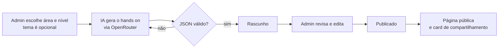

<div align="center">
  
  <h1>hands on</h1>
  <p><strong>Menos tutorial, mais mão na massa.</strong></p>
  <p>Projetos práticos de programação organizados por área, com cenário de empresa, passo a passo, dica e gabarito.</p>
  <p>
    
    
    
    
    
    
    
    
    
    
    
    
  </p>
</div>

---

## O que é

No curso de ADS da FIAP, quase todo capítulo termina com um hands on: um projeto prático que simula um problema real. Este projeto nasceu da vontade de ter **mais desses desafios** para treinar um assunto específico, e de poder compartilhá-los com outros estudantes e devs.

Não é um gerador de desafios aleatórios. Cada hands on:

- parte de um **cenário**: uma empresa fictícia com um problema e uma entrega;
- avança em **passos incrementais**, cada um com critério de conclusão;
- tem **dica** e **gabarito** escondidos em cada passo, para abrir só quando você travar;
- é **revisado por uma pessoa** antes de ser publicado.

### Áreas

| Área | Exemplos de temas |
| --- | --- |
| SQL | JOINs, window functions, índices, transações |
| Software Engineering | refatoração, testes, SOLID, design de APIs |
| Python | automação, pandas, FastAPI, pytest |
| Front-end Web Engineering | HTML semântico, CSS Grid, React, acessibilidade |

## Como funciona



- **Sem tema:** a IA escolhe um tema do banco de temas da área e evita repetir os hands ons que já existem.
- **Validação:** a resposta da IA é validada com zod. Se vier inválida, os erros voltam para o modelo corrigir (até 3 tentativas).
- **Leitura pública:** qualquer pessoa acessa os hands ons publicados, sem conta. Só o admin faz login.

## Stack

- [Next.js 16](https://nextjs.org) (App Router, Server Actions) e React 19
- [Tailwind CSS 4](https://tailwindcss.com)
- [Neon](https://neon.tech) (PostgreSQL serverless) com [Drizzle ORM](https://orm.drizzle.team)
- [Auth.js](https://authjs.dev) com GitHub OAuth
- [OpenRouter](https://openrouter.ai) para geração (modelos gratuitos)
- [react-markdown](https://github.com/remarkjs/react-markdown) e [Shiki](https://shiki.style) para o conteúdo e o destaque de código
- `next/og` para as imagens de compartilhamento

## Rodando localmente

Pré-requisitos: Node 22.18+ (roda TypeScript direto no seed e nos testes) e pnpm.

```bash
pnpm install
cp .env.example .env   # preencha as variáveis (tabela abaixo)
pnpm db:push           # cria as tabelas no Neon
pnpm db:seed           # cria as 4 áreas e o banco de temas
pnpm dev
```

Abra http://localhost:3000/admin, entre com o GitHub configurado em `ADMIN_GITHUB_LOGIN`, gere um hands on, revise e publique.

### Variáveis de ambiente

| Variável | Onde conseguir |
| --- | --- |
| `DATABASE_URL` | Painel da Neon, em **Connection string** (pooled) |
| `AUTH_SECRET` | `npx auth secret` |
| `AUTH_GITHUB_ID` / `AUTH_GITHUB_SECRET` | [GitHub > Developer settings > OAuth Apps](https://github.com/settings/developers), com callback `http://localhost:3000/api/auth/callback/github` |
| `ADMIN_GITHUB_LOGIN` | Seu username do GitHub, o único que consegue entrar no `/admin` |
| `OPENROUTER_API_KEY` | [openrouter.ai/settings/keys](https://openrouter.ai/settings/keys) |
| `OPENROUTER_MODEL` | Um modelo com sufixo `:free` em [openrouter.ai/models](https://openrouter.ai/models?max_price=0) |

> Modelos gratuitos têm limite de pedidos por dia e podem levar alguns minutos por geração. Se aparecer `No endpoints found matching your data policy`, habilite os provedores gratuitos em [openrouter.ai/settings/privacy](https://openrouter.ai/settings/privacy).

### Scripts

| Comando | O que faz |
| --- | --- |
| `pnpm dev` | Servidor de desenvolvimento |
| `pnpm build` | Build de produção (precisa de `DATABASE_URL`, porque a home é pré-renderizada) |
| `pnpm test` | Testes do parser da IA, do schema e do prompt |
| `pnpm lint` | ESLint |
| `pnpm db:push` | Aplica o schema do Drizzle no banco |
| `pnpm db:seed` | Cria ou atualiza as áreas e os temas |

## Estrutura

```
src/
├── app/
│   ├── page.tsx                  home com as áreas
│   ├── [area]/page.tsx           hands ons publicados da área, com filtro de nível
│   ├── [area]/[slug]/page.tsx    o hands on: cenário, passos, dica e gabarito
│   ├── admin/                    listar, gerar, editar e publicar (só admin)
│   └── **/opengraph-image.tsx    cards de compartilhamento
├── auth.ts                       GitHub OAuth e verificação do admin
├── db/                           schema, conexão e seed
├── lib/
│   ├── generate.ts               prompt e chamada ao OpenRouter
│   ├── handson.ts                schema zod e utilitários de texto
│   └── og.tsx                    layout das imagens de compartilhamento
└── components/                   Markdown e logo
```

## Deploy na Vercel

1. Importe o repositório na Vercel.
2. Configure as mesmas variáveis do `.env`.
3. Crie um **segundo** OAuth App no GitHub com callback `https://SEU-DOMINIO/api/auth/callback/github` e use o ID e o secret dele na Vercel.
4. Recomendado: coloque um limite de crédito na chave do OpenRouter e ative uma regra de rate limit no Firewall da Vercel.
  
## Segurança

- Toda página e server action do admin verifica a sessão no servidor.
- Entradas validadas com zod e limites de tamanho; queries parametrizadas pelo Drizzle.
- Headers de segurança (CSP, HSTS, `X-Frame-Options` e outros) em `next.config.ts`.
- O conteúdo gerado pela IA é renderizado sem HTML cru.
- O pnpm não instala versões de pacotes publicadas há menos de 24h.

## Ideias para depois

- [ ] Login para estudantes e progresso por passo
- [ ] Entrega do projeto com feedback por IA
- [ ] Trilhas por área, com os temas já cobertos e os que faltam

## Licença

Distribuído sob a licença [MIT](LICENSE). Você pode usar, modificar e distribuir o código, desde que mantenha o aviso de copyright.
